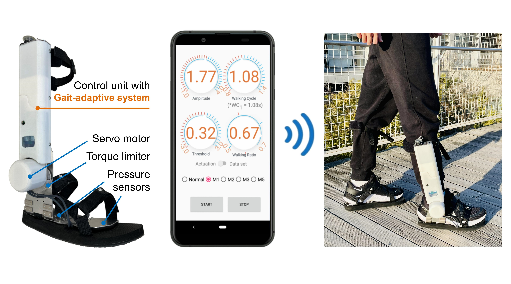

# Abstract

As the population ages, the number of elderly suffering from systemic diseases such as stroke increases. To address this problem, various wearable walking assistive robots have been developed to promote their physical exercise for stroke prevention. Wearable assistive robots have shown the ability to improve human mobility. However, most of these robots are heavy, bulky, and with poor practicability. **In this study, we developed a compact ankle assistive robot for elderly users that can be used for walking exercise promotion.** By informing correct motion and timing, the robot can guide the user to achieve a healthy gait by only assisting their ankle joint. The robot provides faster-than-ankle motion to allow the user to feel facilitated during the walking. Users can adjust the robot’s assistance parameters through a graphical user interface (GUI) according to their demands. **Furthermore, we proposed a gait-adaptive control method for ankle assistive robots to adapt to the user’s changing gait.** Hence, the robot can adjust the assistance parameters automatically to provide more accurate walking assistance. Finally, the results of the evaluation experiment demonstrated the positive feasibility of human gait adaptation. The proposed methods have the advantage of being low-cost and easy to be implemented.

# Demo

# Related Publications

\[1] **M. Xu**, Y. Hua, Y. Li, J. Zhuang, K. Osawa, K. Nakagawa, H. Lee, L. Yuge, E. Tanaka, “Development of an Ankle Assistive Robot with Instantly Gait-Adaptive Method,” in *Journal of Robotics and Mechatronics (JRM)*, 2023. (Accepted)