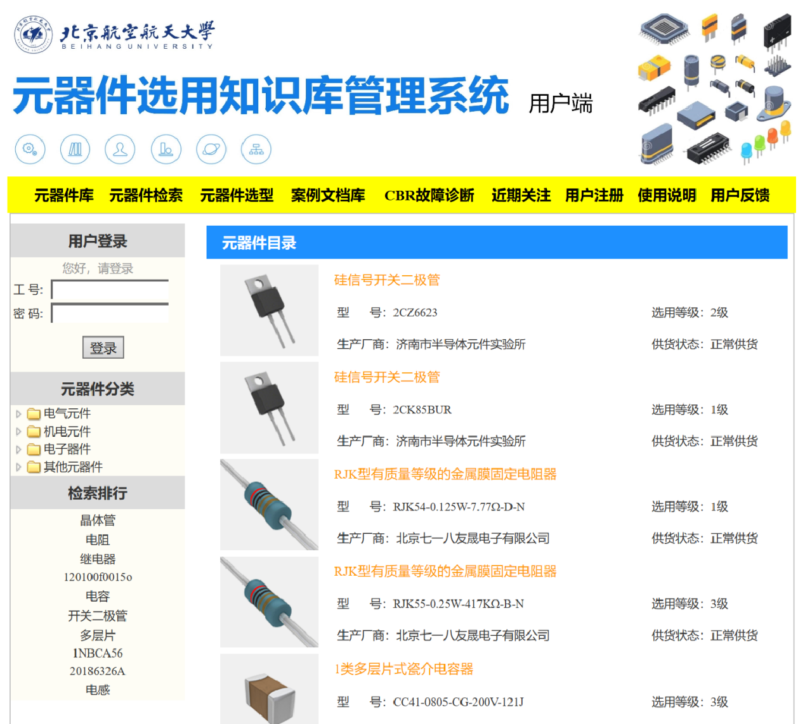

**Members:** Mingyang Xu

**Supervisor:** Prof. Guijiang Duan

# Overview

In this project, a knowledge base management system for components selection was designed. In addition, we tried out the functions of case-based reasoning, such as knowledge-base case searching, case distance estimation and case matching to realize intelligent component troubleshooting.

