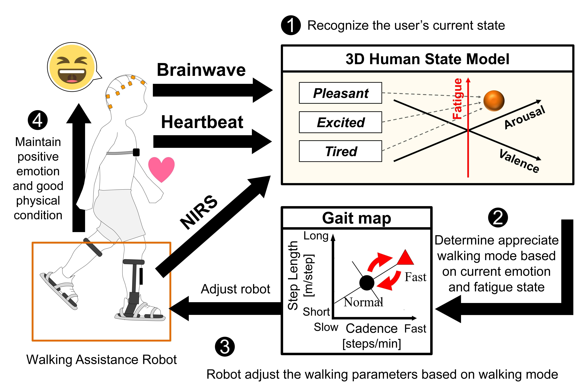

# Abstract

**The purpose of this study is to develop a control system for walking assistive robot that enables the user to keep positive emotions and maintain high levels of motivation during exercise.** In this study, a control method based on emotion recognition and fatigue detection was proposed. We used **brainwave and heartbeat signals** to train a deep neural network (DNN) model to recognize users’ emotions. **Portable near-infrared spectroscopy (NIRS)** was used to detect muscle fatigue. Furthermore, we established a 3D human state model to evaluate the user’s emotional and fatigue states. We also performed experiments to evaluate the ability of the control method to improve the effect of walking exercise.

# Related Publications:

\[1] Y. Li, **M. Xu**, K. Osawa, E. Tanaka, “A Control Method for Walking Assistance Robot Considering Emotion and Body Condition,” in JSME-IIP/ASME-ISPS Joint International Conference on Micromechatronics for Information and Precision Equipment (MIPE 2022), A1-1-03, 2022. 
\[2] Y. Wei, Y. Li, **M. Xu**, Y. Gong, K. Osawa, E. Tanaka, “A Real-Time and Two-Dimensional Emotion Recognition System Based on EEG and HRV Using Machine Learning,” in IEEE/SICE International Symposium on System Integrations (SII 2023), Atlanta, GA, USA, 2023, pp. 1-6.